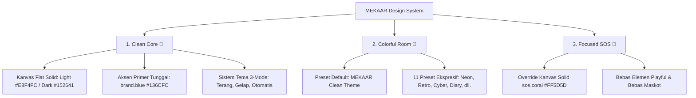

# MEKAAR: Personal-Safety & Privacy-First Messenger

[](https://flutter.dev)
[](LICENSE)
[-136CFC)](https://github.com/tholeteplok/Mekaar_chat)
[](.docs/Mekaar_new_design.md)

**MEKAAR** adalah aplikasi perpesanan instan modern berbasis privasi (*privacy-first*) dan perlindungan keselamatan personal (*personal-safety*). Dirancang dengan arsitektur **Tri-Register** yang menggabungkan estetika antarmuka bersih dan bernapas (*breathable*), kebebasan ekspresi obrolan yang kaya, serta protokol darurat berkecepatan tinggi bersama lingkaran tepercaya (**Guardian**).

---

## 🎨 Sistem Desain Baru MEKAAR (Tri-Register Architecture)

MEKAAR mengadopsi pemisahan visual tiga register untuk menjamin kejelasan fungsi dan fokus pengguna:



1. **Clean Core 🤍 (Chrome, Home, Settings, Guardian, Auth, Navigation):**
   * **Warna Utama:** `brand.blue` (`#136CFC`), `brand.darkBlue` (`#152641`), `brand.green` (`#C3F84A`), `brand.lightBlue` (`#E8F4FC`).
   * **Kanvas Flat:** Menghilangkan gradien visual berat pada navigasi utama untuk menghadirkan ruang baca yang luas dan tenang.
   * **Tipografi:** Plus Jakarta Sans ExtraBold pada Wordmark (tracking -2%) dan Plus Jakarta Sans untuk seluruh teks hierarki.
   * **Sistem 3-Mode:** Mode Terang, Mode Gelap, dan Otomatis (cutoff jam 06.00–17.59 Terang, 18.00–05.59 Gelap).
2. **Colorful Room 🎨 (Chat Room & Media):**
   * **MEKAAR Clean Theme (`mekaar`):** Menjadi tema bawaan default dengan gelembung keluar biru `brand.blue` dan gelembung masuk netral bertepi halus.
   * **11 Presets Ekspresif:** *Neon Dreams, Comic Pop Art, Neumorphism, Glassmorphism, Pixel Garden 8-Bit, Candy Pop, Retro Wave, Mono Vibe, Solarpunk, Kunang-kunang, dan Buku Harian*.
3. **Focused SOS 🚨 (Protokol Darurat & Respon Krisis):**
   * **Total Layer Override:** Kanvas berubah solid `sos.coral` (`#FF5D5D`) / `sos.deep` (`#D92632`) seketika tombol SOS ditekan.
   * **Kejelasan & Urgensi:** Menghilangkan seluruh maskot, konfeti, dan animasi bermain demi prioritas penyelamatan.

---

## 🌟 Fitur Utama

### 💬 1. Obrolan Aman & Bebas Jejak (Private Messaging)
* **Aegis Protocol E2EE:** Enkripsi ujung-ke-ujung penuh berbasis kurva asimetris **X25519** dan cipher **ChaCha20-Poly1305**. Kunci enkripsi dibuat dan disimpan secara lokal di perangkat.
* **View-Once Media:** Kirim foto, video, dan pesan suara sekali lihat yang otomatis kabur (*blurred*) dan terhapus dari memori setelah dibuka.
* **Pesan Menghilang (*Disappearing Messages*):** Atur timer otomatis hapus pesan (1 Jam, 1 Hari, 7 Hari, atau Selamanya).
* **Private Vault Cloaking:** Sembunyikan obrolan sensitif di balik passcode sekunder tanpa meninggalkan petunjuk visual.
* **Anti-Screenshot & Screen Recording Guard:** Proteksi penangkapan layar bidirectional pada area sensitif.

### 🛡️ 2. Jaringan Saling Menjaga (Guardian Network)
* **Izin Berbasis Kebutuhan:** Guardian **tidak dapat** memantau lokasi atau mendengar audio Anda pada kondisi normal. Akses hanya dibuka saat Anda memicu mode darurat SOS.
* **Hangout Sharing & Safety Route:** Siarkan lokasi sementara secara terencana saat bepergian atau nongkrong dengan estimasi waktu kepulangan otomatis.
* **Dynamic Role Swapping:** Persetujuan dua arah untuk saling memantau keselamatan secara simetris antar teman atau keluarga.

### 🚨 3. Respon Darurat Terpadu (SOS Panic System)
* **72px Pulsing Panic Button:** Tombol panik haptic instan di pojok layar utama.
* **Real-time WebRTC Video & Audio Stream:** Siaran langsung umpan kamera dan mikrofon ke layar Guardian terhubung secara instan.
* **GPS Live Tracking:** Pembaruan titik koordinat presisi yang dipetakan di OpenStreetMap (OSM).
* **Device Lost Mode:** Kunci perangkat jarak jauh, nyalakan alarm desibel tinggi, dan tampilkan pesan kontak pemulihan.

---

## 🛠️ Arsitektur Teknologi

* **Frontend Framework:** Flutter (Dart 3.x)
* **State Management:** Riverpod (`StateNotifierProvider`, `StreamProvider`, `FutureProvider`)
* **Backend & Realtime:** Supabase (PostgreSQL, Row Level Security / RLS, Edge Functions, Realtime Channels)
* **Streaming & Komunikasi Realtime:** WebRTC (`flutter_webrtc`)
* **Pemetaan & Geospasial:** OpenStreetMap via `flutter_map` & `latlong2`
* **Penyimpanan Kunci Kriptografi:** `flutter_secure_storage` & SHA-256 Hashing dengan proteksi Brute-force Lockout

---

## 📂 Struktur Direktori

```text
lib/
├── core/
│   ├── constants/       # Token warna (colors.dart), tema (themes.dart), shadows, tipografi
│   ├── routes/          # Navigasi terpusat (app_routes.dart)
│   ├── theme/           # Chat preset resolver & spesifikasi tema 12 preset
│   ├── utils/           # Time theme helper, permission helpers, media compressor
│   └── widgets/         # Komponen UI sentral (Wordmark, BottomNav, PermissionsBottomSheet, CryptoDonation)
├── data/
│   ├── models/          # Model data (Profile, Message, Guardian, ChatTheme, SOSSession)
│   ├── repositories/    # Logika interaksi database Supabase & SQLite
│   └── services/        # Layanan enkripsi E2EE, WebRTC, Location, Haptic, Update
└── features/
    ├── auth/            # Login, Register, PIN Lock, Duress PIN, 2FA, Splash Screen
    ├── chat/            # Chat room, composer, group management, attachment sheets
    ├── guardian/        # Guardian list, QR scanning, Hangout session
    ├── map/             # Pelacakan peta darurat OSM
    ├── settings/        # Pengaturan tampilan/tema, privasi, Tentang Mekaar
    └── sos/             # Papan darurat SOS aktif, camera live streaming, HP hilang
```

---

## 🚀 Panduan Memulai (*Quick Start*)

### 1. Prasyarat Lingkungan
Pastikan Flutter SDK terpasang di sistem Anda (`flutter --version` >= 3.x).

### 2. Konfigurasi Backend Supabase
Jalankan seluruh skrip migrasi SQL di `supabase/migrations/` secara berurutan (dari `01_initial_schema.sql` hingga migrasi terbaru) melalui **SQL Editor** pada project Supabase Anda.

### 3. Setup File Konfigurasi `.env`
Buat file `.env` pada direktori root proyek (file ini diabaikan oleh Git demi keamanan):
```env
SUPABASE_URL=https://your-project-id.supabase.co
SUPABASE_ANON_KEY=eyJhbGciOiJIUzI1NiIsInR5cCI6IkpXVCJ9...
```

### 4. Instalasi & Menjalankan Aplikasi
```bash
# Unduh seluruh dependensi
flutter pub get

# Jalankan pengujian otomatis (Unit & Widget Tests)
flutter test

# Jalankan aplikasi ke emulator atau perangkat fisik
flutter run
```

---

## 💙 Dukung Pengembangan MEKAAR (*Crypto Donation*)

MEKAAR dikembangkan sebagai sistem keselamatan personal independen **tanpa iklan** dan **tanpa monetisasi/penjualan data pengguna**.

Bila Anda ingin mendukung biaya pemeliharaan server *relay*, infrastruktur WebRTC, dan riset kriptografi, Anda dapat memberikan kontribusi sukarela melalui alamat dompet berikut:

| Jaringan / Koin | Alamat Dompet (*Wallet Address*) |
|---|---|
| **Solana (SOL & SPL)** | `8NygxsjfWmcDMMTVuBS2VSAq7b6MnfGTqsPutCfLobyk` |
| **EVM Multi-Chain (ETH, Base, Arbitrum, Polygon, BNB)** | `0x49a2013dcbb322079e18136e25e39ab940a74c5e` |
| **TRON (TRX & USDT-TRC20)** | `TBQf6zEfjhsBbcAAyam626JED3ordfX6Y1` |
| **Bitcoin (BTC Native)** | `bc1pywldcavnzq7ztmsqvm8unq3rkrlzafvenzhgmsvz7t32ysq0lcvqmcwfvw` |

*Alamat di atas juga dapat disalin langsung dengan 1-klik melalui menu **Pengaturan** ➔ **Tentang MEKAAR** di dalam aplikasi.*

---

## 📜 Lisensi
Proyek ini didistribusikan di bawah lisensi terbuka [MIT License](LICENSE).
Semua hak atas perlindungan keselamatan dan kebebasan privasi pengguna dijamin penuh.
